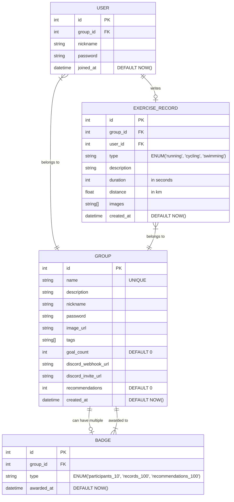

# mermaid

```mermaid
erDiagram
    GROUP {
        int id PK
        string name "UNIQUE" 
        string description
        string nickname
        string password
        string image_url
        string[] tags
        int goal_count "DEFAULT 0"
        string discord_webhook_url
        string discord_invite_url
        int recommendations "DEFAULT 0"
        datetime created_at "DEFAULT NOW()"
    }

    USER {
        int id PK
        int group_id FK
        string nickname
        string password
        datetime joined_at "DEFAULT NOW()"
    }
    USER }|--|| GROUP : "belongs to"
    USER ||--o| EXERCISE_RECORD : "writes"

    EXERCISE_RECORD {
        int id PK
        int group_id FK
        int user_id FK
        string type "ENUM('running', 'cycling', 'swimming')"
        string description
        int duration "in seconds"
        float distance "in km"
        string[] images
        datetime created_at "DEFAULT NOW()"
    }
    EXERCISE_RECORD }|--|| GROUP : "belongs to"

    BADGE {
        int id PK
        int group_id FK
        string type "ENUM('participants_10', 'records_100', 'recommendations_100')"
        datetime awarded_at "DEFAULT NOW()"
    }
    BADGE }|--|| GROUP : "awarded to"

    GROUP ||--o| BADGE : "can have multiple"
```
