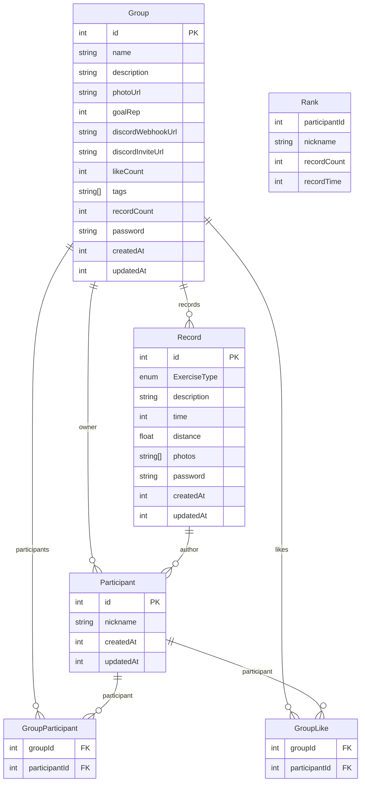

```mermaid
erDiagram
    Participant {
        int id PK
        string nickname
        int createdAt
        int updatedAt
    }
    Group {
        int id PK
        string name
        string description
        string photoUrl
        int goalRep
        string discordWebhookUrl
        string discordInviteUrl
        int likeCount
        string[] tags
        int recordCount
        string password
        int createdAt
        int updatedAt
    }
    Record {
        int id PK
        enum ExerciseType
        string description
        int time
        float distance
        string[] photos
        string password
        int createdAt
        int updatedAt
    }
    Rank {
        int participantId
        string nickname
        int recordCount
        int recordTime
    }

    GroupParticipant {
        int groupId FK
        int participantId FK
    }

    GroupLike {
        int groupId FK
        int participantId FK
    }

    Group ||--o{ Participant : owner
    Group ||--o{ GroupParticipant : participants
    Participant ||--o{ GroupParticipant : participant
    Group ||--o{ Record : records
    Record ||--o{ Participant : author
    Group ||--o{ GroupLike : likes
    Participant ||--o{ GroupLike : participant
```
