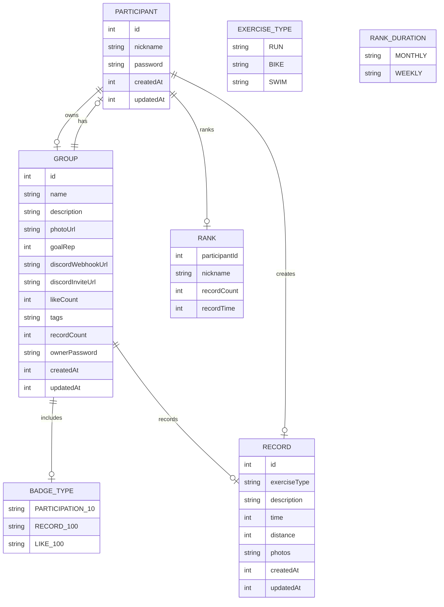

```mermaid
erDiagram
    PARTICIPANT {
        int id
        string nickname
        string password
        int createdAt
        int updatedAt
    }
    GROUP {
        int id
        string name
        string description
        string photoUrl
        int goalRep
        string discordWebhookUrl
        string discordInviteUrl
        int likeCount
        string tags
        int recordCount
        string ownerPassword
        int createdAt
        int updatedAt
    }
    RECORD {
        int id
        string exerciseType
        string description
        int time
        int distance
        string photos
        int createdAt
        int updatedAt
    }
    RANK {
        int participantId
        string nickname
        int recordCount
        int recordTime
    }
    BADGE_TYPE {
        string PARTICIPATION_10
        string RECORD_100
        string LIKE_100
    }
    EXERCISE_TYPE {
        string RUN
        string BIKE
        string SWIM
    }
    RANK_DURATION {
        string MONTHLY
        string WEEKLY
    }

    PARTICIPANT ||--o| GROUP : owns
    GROUP ||--o| PARTICIPANT : has
    GROUP ||--o| BADGE_TYPE : includes
    GROUP ||--o| RECORD : records
    PARTICIPANT ||--o| RECORD : creates
    PARTICIPANT ||--o| RANK : ranks
```
