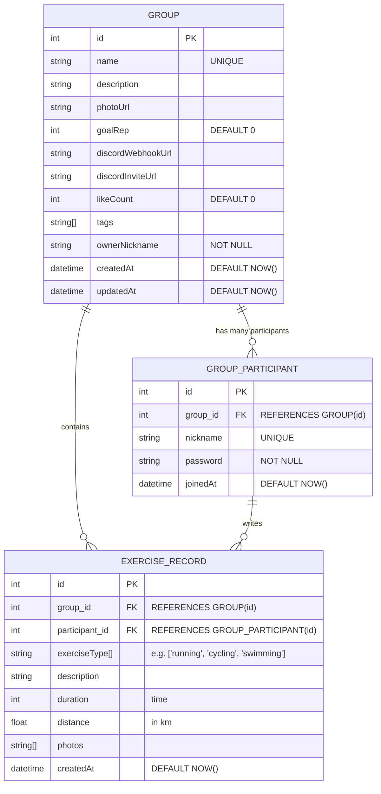

```mermaid
erDiagram
    GROUP {
        int id PK
        string name "UNIQUE"
        string description
        string photoUrl
        int goalRep "DEFAULT 0"
        string discordWebhookUrl
        string discordInviteUrl
        int likeCount "DEFAULT 0"
        string[] tags
        string ownerNickname "NOT NULL"
        datetime createdAt "DEFAULT NOW()"
        datetime updatedAt "DEFAULT NOW()"
    }

    GROUP_PARTICIPANT {
        int id PK
        int group_id FK "REFERENCES GROUP(id)"
        string nickname "UNIQUE"
        string password "NOT NULL"
        datetime joinedAt "DEFAULT NOW()"
    }

    GROUP ||--o{ GROUP_PARTICIPANT : "has many participants"

    EXERCISE_RECORD {
        int id PK
        int group_id FK "REFERENCES GROUP(id)"
        int participant_id FK "REFERENCES GROUP_PARTICIPANT(id)"
        string exerciseType[] "e.g. ['running', 'cycling', 'swimming']"
        string description
        int duration "time"
        float distance "in km"
        string[] photos
        datetime createdAt "DEFAULT NOW()"
    }

    GROUP ||--o{ EXERCISE_RECORD : "contains"
    GROUP_PARTICIPANT ||--o{ EXERCISE_RECORD : "writes"
```
