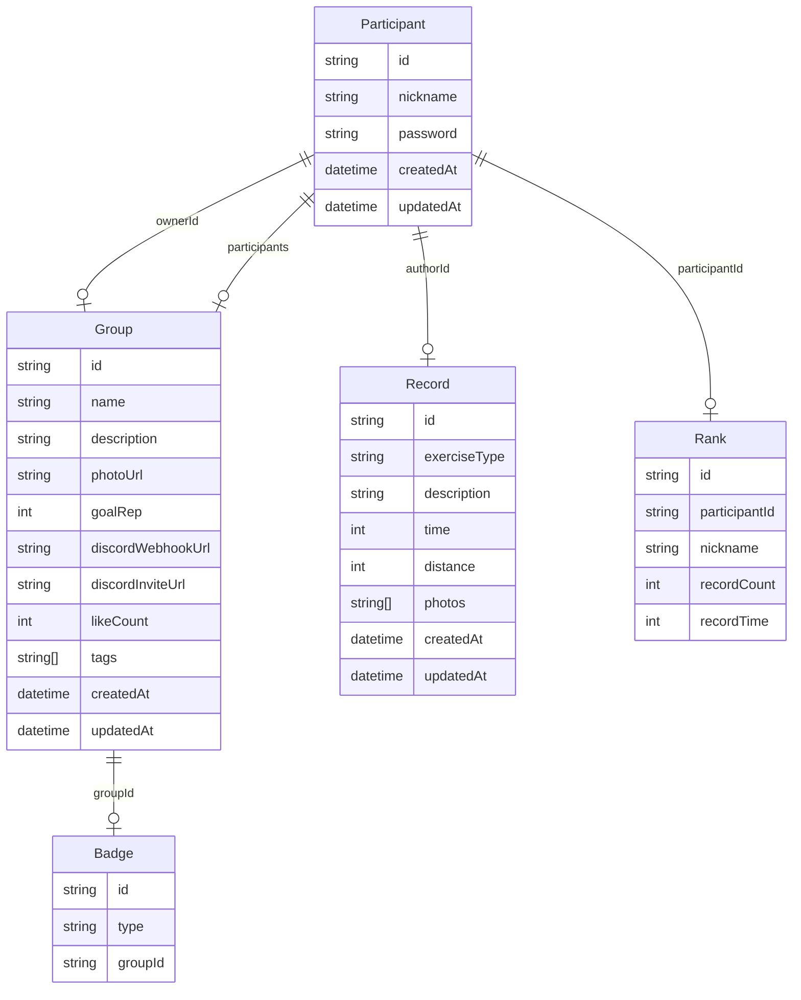

```mermaid
erDiagram
    Participant {
        string id
        string nickname
        string password
        datetime createdAt
        datetime updatedAt
    }

    Group {
        string id
        string name
        string description
        string photoUrl
        int goalRep
        string discordWebhookUrl
        string discordInviteUrl
        int likeCount
        string[] tags
        datetime createdAt
        datetime updatedAt
    }

    Record {
        string id
        string exerciseType
        string description
        int time
        int distance
        string[] photos
        datetime createdAt
        datetime updatedAt
    }

    Badge {
        string id
        string type
        string groupId
    }

    Rank {
        string id
        string participantId
        string nickname
        int recordCount
        int recordTime
    }

    Participant ||--o| Group : "ownerId"
    Participant ||--o| Group : "participants"
    Participant ||--o| Record : "authorId"
    Group ||--o| Badge : "groupId"
    Participant ||--o| Rank : "participantId"
```
