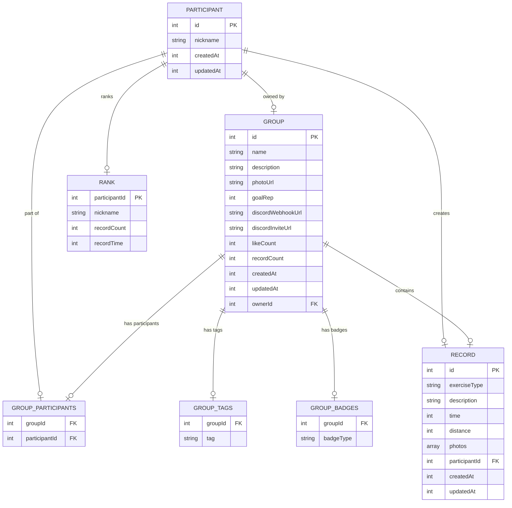

```mermaid
erDiagram
    PARTICIPANT {
        int id PK
        string nickname
        int createdAt
        int updatedAt
    }

    GROUP {
        int id PK
        string name
        string description
        string photoUrl
        int goalRep
        string discordWebhookUrl
        string discordInviteUrl
        int likeCount
        int recordCount
        int createdAt
        int updatedAt
        int ownerId FK
    }

    GROUP_PARTICIPANTS {
        int groupId FK
        int participantId FK
    }

    GROUP_TAGS {
        int groupId FK
        string tag
    }

    GROUP_BADGES {
        int groupId FK
        string badgeType
    }

    RECORD {
        int id PK
        string exerciseType
        string description
        int time
        int distance
        array photos
        int participantId FK
        int createdAt
        int updatedAt
    }

    RANK {
        int participantId PK
        string nickname
        int recordCount
        int recordTime
    }

    PARTICIPANT ||--o| GROUP : "owned by"
    PARTICIPANT ||--o| GROUP_PARTICIPANTS : "part of"
    GROUP ||--o| GROUP_PARTICIPANTS : "has participants"
    GROUP ||--o| GROUP_TAGS : "has tags"
    GROUP ||--o| GROUP_BADGES : "has badges"
    PARTICIPANT ||--o| RECORD : "creates"
    GROUP ||--o| RECORD : "contains"
    PARTICIPANT ||--o| RANK : "ranks"
```
