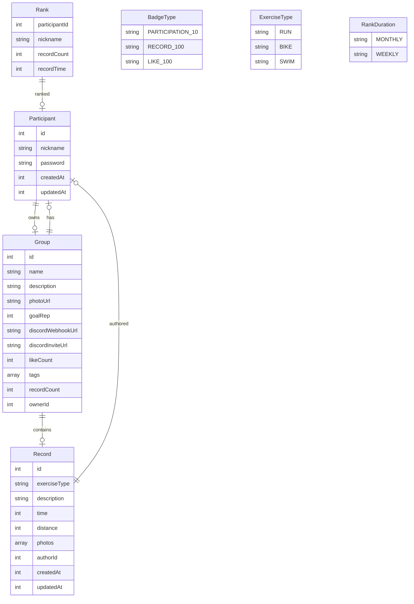

```mermaid
erDiagram
    Participant {
        int id
        string nickname
        string password
        int createdAt
        int updatedAt
    }

    Group {
        int id
        string name
        string description
        string photoUrl
        int goalRep
        string discordWebhookUrl
        string discordInviteUrl
        int likeCount
        array tags
        int recordCount
        int ownerId
    }

    Record {
        int id
        string exerciseType
        string description
        int time
        int distance
        array photos
        int authorId
        int createdAt
        int updatedAt
    }

    Rank {
        int participantId
        string nickname
        int recordCount
        int recordTime
    }

    Participant ||--o| Group : owns
    Group ||--o| Participant : has
    Group ||--o| Record : contains
    Record ||--o| Participant : authored
    Rank ||--o| Participant : ranked

    BadgeType {
        string PARTICIPATION_10
        string RECORD_100
        string LIKE_100
    }

    ExerciseType {
        string RUN
        string BIKE
        string SWIM
    }

    RankDuration {
        string MONTHLY
        string WEEKLY
    }
```
