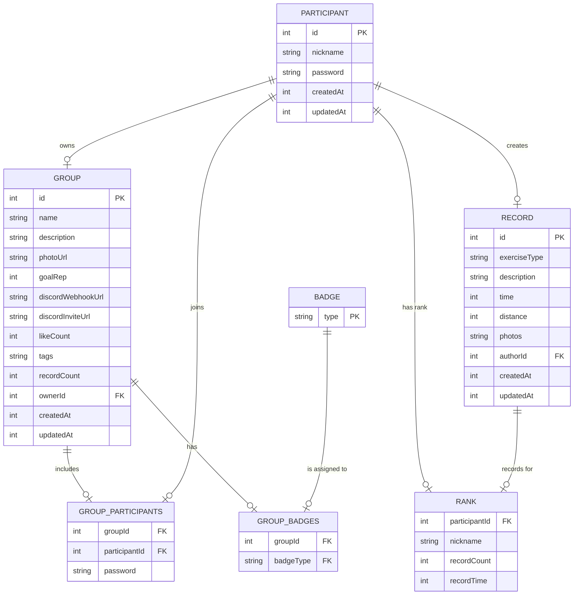

```mermaid
erDiagram
    PARTICIPANT {
        int id PK
        string nickname
        string password
        int createdAt
        int updatedAt
    }

    GROUP {
        int id PK
        string name
        string description
        string photoUrl
        int goalRep
        string discordWebhookUrl
        string discordInviteUrl
        int likeCount
        string tags
        int recordCount
        int ownerId FK
        int createdAt
        int updatedAt
    }

    GROUP_PARTICIPANTS {
        int groupId FK
        int participantId FK
        string password
    }

    BADGE {
        string type PK
    }

    GROUP_BADGES {
        int groupId FK
        string badgeType FK
    }

    RECORD {
        int id PK
        string exerciseType
        string description
        int time
        int distance
        string photos
        int authorId FK
        int createdAt
        int updatedAt
    }

    RANK {
        int participantId FK
        string nickname
        int recordCount
        int recordTime
    }

    PARTICIPANT ||--o| GROUP : "owns"
    PARTICIPANT ||--o| RECORD : "creates"
    GROUP ||--o| GROUP_PARTICIPANTS : "includes"
    PARTICIPANT ||--o| GROUP_PARTICIPANTS : "joins"
    GROUP ||--o| GROUP_BADGES : "has"
    BADGE ||--o| GROUP_BADGES : "is assigned to"
    PARTICIPANT ||--o| RANK : "has rank"
    RECORD ||--o| RANK : "records for"
```
