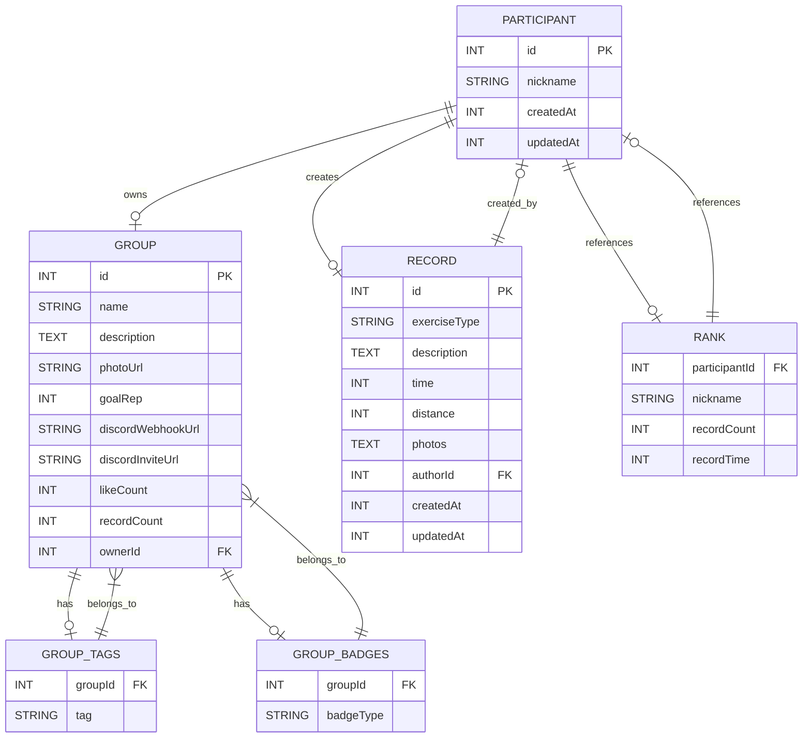

```mermaid
erDiagram
    PARTICIPANT {
        INT id PK
        STRING nickname
        INT createdAt
        INT updatedAt
    }
    
    GROUP {
        INT id PK
        STRING name
        TEXT description
        STRING photoUrl
        INT goalRep
        STRING discordWebhookUrl
        STRING discordInviteUrl
        INT likeCount
        INT recordCount
        INT ownerId FK
    }

    GROUP_TAGS {
        INT groupId FK
        STRING tag
    }

    GROUP_BADGES {
        INT groupId FK
        STRING badgeType
    }

    RECORD {
        INT id PK
        STRING exerciseType
        TEXT description
        INT time
        INT distance
        TEXT photos
        INT authorId FK
        INT createdAt
        INT updatedAt
    }

    RANK {
        INT participantId FK
        STRING nickname
        INT recordCount
        INT recordTime
    }

    PARTICIPANT ||--o| GROUP : owns
    PARTICIPANT ||--o| RECORD : creates
    PARTICIPANT ||--o| RANK : references
    GROUP ||--o| GROUP_TAGS : has
    GROUP ||--o| GROUP_BADGES : has
    GROUP_TAGS ||--|{ GROUP : belongs_to
    GROUP_BADGES ||--|{ GROUP : belongs_to
    RECORD ||--o| PARTICIPANT : created_by
    RANK ||--o| PARTICIPANT : references
```
