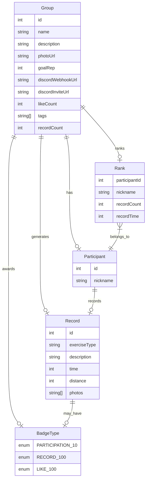

```mermaid
erDiagram
    Group {
        int id
        string name
        string description
        string photoUrl
        int goalRep
        string discordWebhookUrl
        string discordInviteUrl
        int likeCount
        string[] tags
        int recordCount
    }
    Participant {
        int id
        string nickname
    }
    Record {
        int id
        string exerciseType
        string description
        int time
        int distance
        string[] photos
    }
    Rank {
        int participantId
        string nickname
        int recordCount
        int recordTime
    }
    BadgeType {
        enum PARTICIPATION_10
        enum RECORD_100
        enum LIKE_100
    }

    Group ||--o| Participant: "has"
    Group ||--o| Record: "generates"
    Group ||--o| Rank: "ranks"
    Group ||--o| BadgeType: "awards"
    Participant ||--o| Record: "records"
    Rank }|--|| Participant: "belongs_to"
    Record ||--o| BadgeType: "may_have"
```
