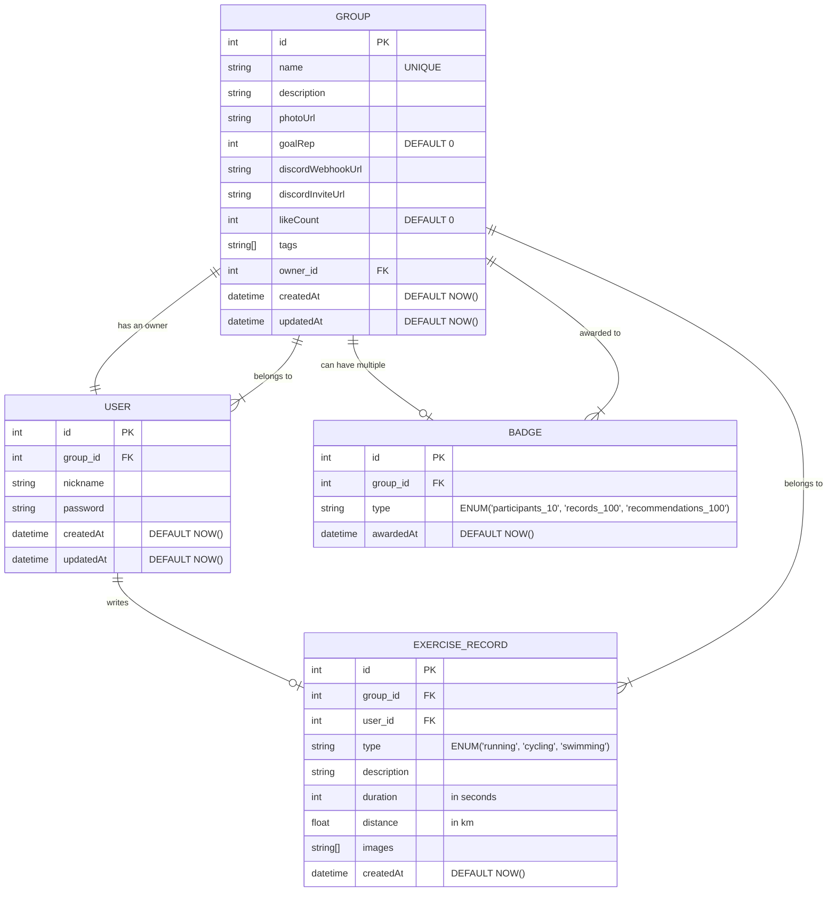

```mermaid
erDiagram
    GROUP {
        int id PK
        string name "UNIQUE"
        string description
        string photoUrl
        int goalRep "DEFAULT 0"
        string discordWebhookUrl
        string discordInviteUrl
        int likeCount "DEFAULT 0"
        string[] tags
        int owner_id FK
        datetime createdAt "DEFAULT NOW()"
        datetime updatedAt "DEFAULT NOW()"
    }

    USER {
        int id PK
        int group_id FK
        string nickname
        string password
        datetime createdAt "DEFAULT NOW()"
        datetime updatedAt "DEFAULT NOW()"
    }
    USER }|--|| GROUP : "belongs to"
    USER ||--o| EXERCISE_RECORD : "writes"
    GROUP ||--|| USER : "has an owner"

    EXERCISE_RECORD {
        int id PK
        int group_id FK
        int user_id FK
        string type "ENUM('running', 'cycling', 'swimming')"
        string description
        int duration "in seconds"
        float distance "in km"
        string[] images
        datetime createdAt "DEFAULT NOW()"
    }
    EXERCISE_RECORD }|--|| GROUP : "belongs to"

    BADGE {
        int id PK
        int group_id FK
        string type "ENUM('participants_10', 'records_100', 'recommendations_100')"
        datetime awardedAt "DEFAULT NOW()"
    }
    BADGE }|--|| GROUP : "awarded to"

    GROUP ||--o| BADGE : "can have multiple"
```
