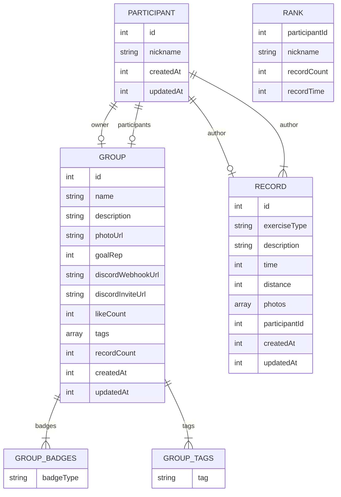

```mermaid
erDiagram
    PARTICIPANT {
        int id
        string nickname
        int createdAt
        int updatedAt
    }
    GROUP {
        int id
        string name
        string description
        string photoUrl
        int goalRep
        string discordWebhookUrl
        string discordInviteUrl
        int likeCount
        array tags
        int recordCount
        int createdAt
        int updatedAt
    }
    RECORD {
        int id
        string exerciseType
        string description
        int time
        int distance
        array photos
        int participantId
        int createdAt
        int updatedAt
    }
    RANK {
        int participantId
        string nickname
        int recordCount
        int recordTime
    }

    PARTICIPANT ||--o| GROUP : "owner"
    PARTICIPANT ||--o| GROUP : "participants"
    PARTICIPANT ||--o| RECORD : "author"
    GROUP ||--|{ GROUP_BADGES : "badges"
    GROUP ||--|{ GROUP_TAGS : "tags"
    RECORD }|--|| PARTICIPANT : "author"

    GROUP_BADGES {
        string badgeType
    }

    GROUP_TAGS {
        string tag
    }
```
