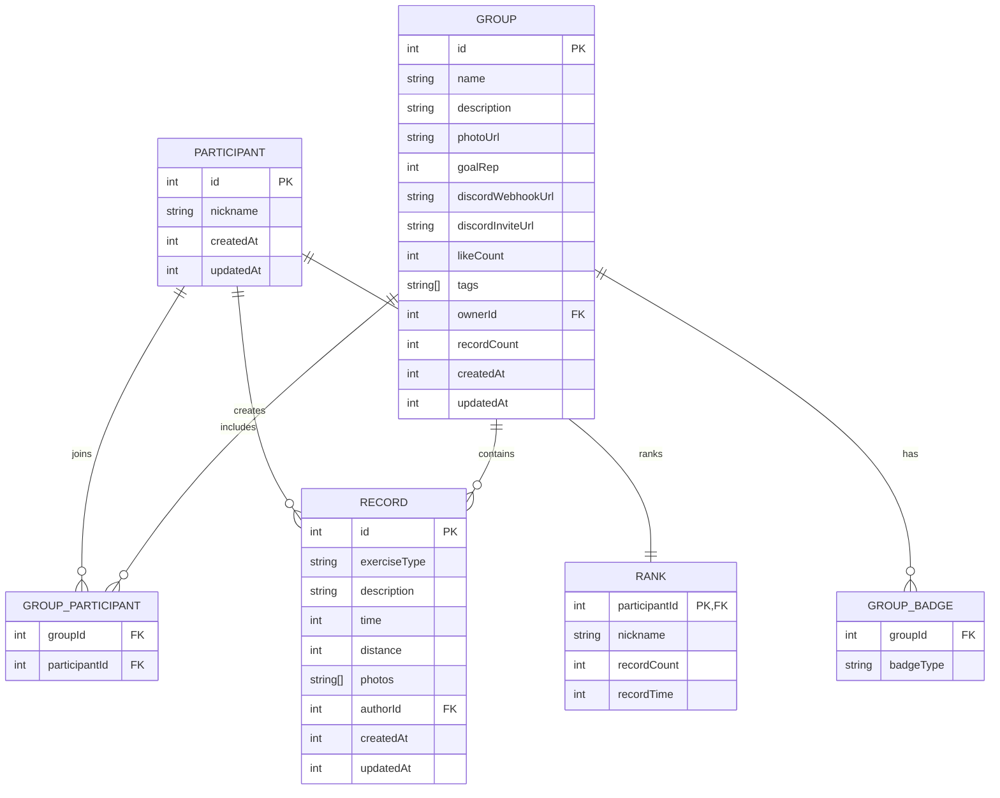

```mermaid
erDiagram
  PARTICIPANT {
    int id PK
    string nickname
    int createdAt
    int updatedAt
  }
  
  GROUP {
    int id PK
    string name
    string description
    string photoUrl
    int goalRep
    string discordWebhookUrl
    string discordInviteUrl
    int likeCount
    string[] tags
    int ownerId FK
    int recordCount
    int createdAt
    int updatedAt
  }
  
  RECORD {
    int id PK
    string exerciseType
    string description
    int time
    int distance
    string[] photos
    int authorId FK
    int createdAt
    int updatedAt
  }
  
  RANK {
    int participantId PK, FK
    string nickname
    int recordCount
    int recordTime
  }
  
  GROUP_PARTICIPANT {
    int groupId FK
    int participantId FK
  }
  
  GROUP_BADGE {
    int groupId FK
    string badgeType
  }
  
  PARTICIPANT ||--o{ GROUP_PARTICIPANT : joins
  GROUP ||--o{ GROUP_PARTICIPANT : includes
  PARTICIPANT ||--o{ RECORD : creates
  GROUP ||--o{ RECORD : contains
  PARTICIPANT ||--|| RANK : ranks
  GROUP ||--o{ GROUP_BADGE : has
```
